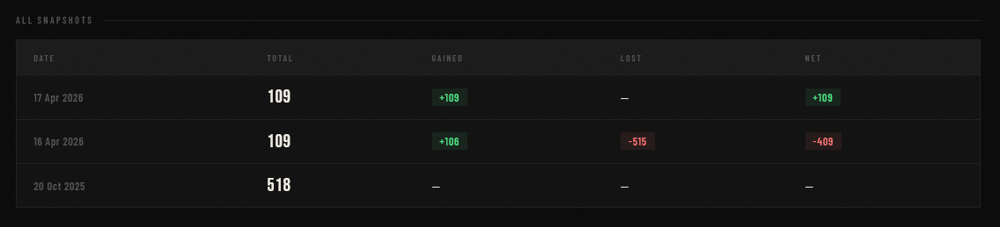
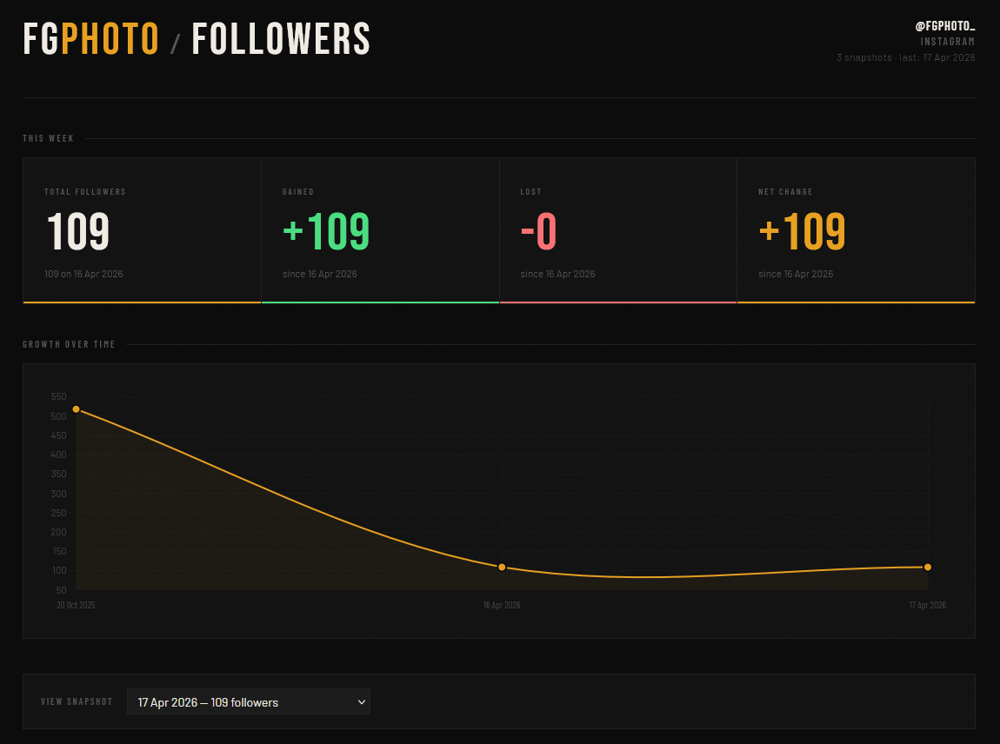
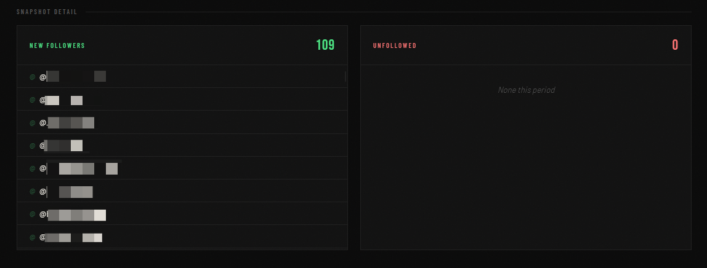

# Instagram Tracker

A **Python tool** to monitor and visualize your Instagram followers history from the official **Instagram data export**.  
The main goals are:
- Track **who starts following you**;  
- Track **who stops following you**;  
- Maintain a **master list of followers**;  
- and show everything in an **interactive dashboard** with clickable links to Instagram profiles.

---

## 📌 Prerequisites

- Python 3.8+
- Your **Instagram data export ZIP** (containing `followers_*.json` inside `connections/followers_and_following`).

---

## 📥 Quick installation

1. **Clone the repository:**
   ```bash
   git clone https://github.com/filipecosgom/Instagram-tracker.git
   cd Instagram-tracker
   ```

2. **Prepare your environment:**
   - Create a virtual environment:
     ```bash
     python -m venv venv
     source venv/bin/activate   # Linux/Mac
     # or
     venv\Scripts\activate      # Windows
     ```
   - Install dependencies (if any):
     ```bash
     pip install -r requirements.txt   # if used in the future
     ```

3. **Place your export ZIP:**
   - Put your Instagram ZIP (e.g. `instagram-fgphoto-2026-04-16-...zip`) into:
     - `data/snapshots/input/`
   - It will be processed and moved to `data/snapshots/processed/`.

4. **Run the script:**
   ```bash
   python tracker.py
   ```

   The script automatically generates `dashboard.html` and opens the browser.

---

## 📱 Dashboard screenshots

### 📊 Snapshot list



> Table showing **date, total followers, new followers (+)** and **lost followers (‑)** for each snapshot.

---

### 📈 Graph of followers



> Graph showing the **evolution of follower count** over time (if you later add Chart.js or another chart library, this image reflects the idea).

---

### 🎯 Followers panel



> Panel with the **list of current followers**, where usernames are clickable and open the Instagram profile in a new tab.

---

## 💡 Configuring `master_followers.json`

- The file `data/master_followers.json` stores the **master list** of your current followers.  
- To **manually import** all your current followers:
  ```bash
  cp data/your_current_followers.json data/master_followers.json
  ```
- On each snapshot, the script:
  - **adds** new followers;  
  - **removes** those that disappear from the JSON (assuming they stopped following you).

---

## 📐 Data flow

1. **Place the ZIP into `data/snapshots/input/`**  
   - The script reads `followers_1.json` (and `followers_*.json` if present).
2. **It computes:**
   - `gained` = new followers between snapshots;  
   - `lost` = possible unfollows.
3. **It updates:**
   - `data/history.json` (snapshot tables);  
   - `data/master_followers.json` (master list);  
   - `web/index.html` (dashboard HTML).

---

## 📄 Code structure

```bash
instagram-tracker/
├── app/
│   ├── instagram_tracker.py    # main logic
│   ├── instagram_data.py       # load/save data
│   ├── instagram_parser.py     # JSON parsing
│   └── __main__.py             # entry point
├── web/
│   ├── index.html              # dashboard
│   ├── css/style.css           # styles
│   ├── js/main.js              # interactivity (charts, etc.)
│   └── assets/screenshots/     # images
├── data/
│   ├── snapshots/
│   ├── history.json
│   ├── master_followers.json
│   └── followers.json
├── scripts/
│   └── extract_followers.py
└── README.md
```

---

## 🚀 Next steps

- Add **charts** (Chart.js) to show follower evolution over time.  
- Implement **date filtering** in the dashboard.  
- Introduce **advanced metrics** (e.g. average time a follower stays).